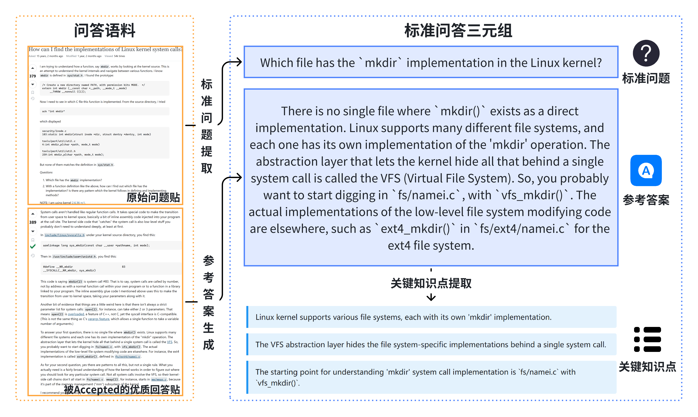

# LKQABench

LKQABench 是**首个面向Linux 内核开发知识的高质量问答评测基准**，旨在系统评估大语言模型（LLM）在复杂系统软件领域中的知识理解与问答能力，为模型在系统软件开发场景下的能力优化、对比分析与实践评估提供重要参考。

该基准数据集基于 Linux 技术社区的真实问答与邮件讨论构建，经过多阶段的数据筛选、语料统一、问答抽取与人工审核，形成了包含 **202 个高质量问答对** 的评测集，覆盖内核关键子系统、核心概念及多层次认知维度。

为实现客观、自动化的模型评测，LKQABench 设计了 **MJ-CCE（Multi-Judge Collaborative Code QA Evaluation）** 方法，采用多模型协同裁判（LLM-as-Judge）机制，从**关键知识点覆盖度**、**事实正确性**和**表达清晰度**三个维度进行综合打分，并通过共识融合策略提升评测的稳定性与一致性。

本仓库公开了 **LKQABench构造过程中使用的Prompt** 以及 **MJ-CCE的全流程代码**，为后续研究提供了可复现、可扩展的评测基准。

## 数据集说明

**LKQABench** 数据集存储于文件 [LKQABench.json](./dataset/LKQABench.json) 中，共包含 **202 个问答对**。
每个问答样本由以下字段组成：

* **`id`**：问答对的唯一标识符。
* **`question`**：标准问题文本。
* **`answer`**：对应的参考答案。
* **`key_points`**：答案中的关键知识点列表。
* **`topics`**：主题维度问题分类。
* **`cognitive_level`**：认知维度问题分类。
* **`is_version_specific`**：版本相关性问题分类。

以下为一个示例条目：

```json
{
    "id": 9,
    "question": "How does POSIX Message Queue differ from System V IPC message queue?",
    "answer": "POSIX Message Queue extends System V IPC message queue by adding functionalities such as a simple file-based interface to the application, support for message priorities, support for asynchronous notification, and timeouts for blocking operations.",
    "key_points": [
        "Simple file-based interface",
        "Support for message priorities",
        "Support for asynchronous notification",
        "Timeouts for blocking operations"
    ],
    "topics": ["进程管理"],
    "cognitive_level": "机制理解层",
    "is_version_specific": 0
}
```

## 数据集构建方法

**LKQABench** 数据集的构建遵循系统化流程，具体方法和设计细节详见论文正文。
在构建过程中，我们综合使用了多个大语言模型，以确保生成问答样本的**多样性、准确性与通用性**。

### Prompt 细节

所有用于数据集构建的 Prompt 说明可在 [prompts.md](./prompts.md) 文档中查阅。

### 构建示例

下图简要展示了数据集构建的示例流程，完整的构建步骤与原理说明请参阅论文相关章节：



## 自动化评测方法（MJ-CCE）

我们提出了 **MJ-CCE（Multi-Judge Collaborative Code QA Evaluation）** 方法，通过多个高性能大语言模型协同担任裁判，对候选模型的回答进行多维度、自动化的质量评测。

### Prompt 细节

所有用于自动化评测的 Prompt 说明可在 [prompts.md](./prompts.md) 文档中查阅。

### MJ-CCE 使用说明

#### 完整流程图

```
新增模型配置  →  Fetch  →  Judge  →  Fusion  →  Score
     ↓           ↓         ↓         ↓          ↓
新增模型配置    获取回答   评估回答    融合评估    量化评分
```

#### 详细流程说明

1. **新增模型配置** - 使用 `save_new_models.py` 将新模型信息保存到数据库
2. **Fetch** - 选择被测模型和问题，获取模型回答并保存到数据库
3. **Judge** - 选择被测模型、裁判模型和问题，让裁判模型独立评估回答
4. **Fusion** - 选择被测模型、裁判模型和问题，融合多个裁判的评估结果
5. **Score** - 选择被测模型和问题，计算量化评分并输出到文件

#### 操作步骤

1. [数据集初始化](#数据集初始化)
2. [新增模型配置](#新增模型配置)
3. [运行Fetch工具](#Fetch工具)
4. [运行Judge工具](#Judge工具)
5. [运行Fusion工具](#Fusion工具)
6. [运行Score工具](#Score工具)

#### 数据集初始化

1. 根据`config.ini.example`创建`config.ini`
2. 根据实际情况修改`config.ini`中的数据库参数，执行`dataset/schema.sql`中的SQL指令初始化数据库
3. 根据实际情况进行模型（被测大模型、裁判大模型）设置，模型设置参见[新增模型配置](#新增模型配置)

#### 新增模型配置

##### 使用 save_new_models.py 新增模型

当需要在系统中添加新的大模型时，可以使用 `save_new_models.py` 脚本将模型配置批量保存到数据库中。

**操作步骤：**

1. **准备模型配置文件**
   
   创建一个JSON文件（如 `new_models_to_save.json`），按照以下格式填写新模型信息：
   
   ```json
   {
     "models": [
       {
         "new_model": true,
         "model_name": "Claude 3.5 Sonnet",
         "model_id": "claude-3-5-sonnet-20241022",
         "api_key": "your_api_key_here",
         "base_url": "https://api.anthropic.com",
         "api_type": "Anthropic",
         "model_type": "chat",
         "model_remark": "Claude 3.5 Sonnet模型"
       }
     ]
   }
   ```

2. **运行保存脚本**
   
   ```bash
   python save_new_models.py --file new_models_to_save.json
   ```

3. **验证保存结果**
   
   脚本会自动将新模型信息插入数据库，并返回分配的 `llm_model_id`，后续在配置文件中可以使用这个ID引用该模型。

**参数说明：**

| 参数 | 类型 | 默认值 | 说明 |
|------|------|--------|------|
| `--file` | `str` | `new_models_to_save.json` | 包含新模型配置的JSON文件路径 |

**注意事项：**
- 确保API Key的有效性和权限
- `model_id` 必须与API提供方的模型标识符完全一致
- 保存成功后，可以在各工具的配置文件中通过 `llm_model_id` 引用该模型

#### 模型设置

##### 使用说明

在运行 **Fetch / Judge / Fusion** 等工具之前，需要在配置文件中设置大模型相关参数。

不同工具对应的配置文件路径：

* **Fetch**: 
  * 被测模型：`src/llm_qa_eval_fetch_eval_models.json`
* **Judge**: 
  * 被测模型：`src/llm_qa_eval_judge_eval_models.json`
  * 裁判模型：`src/llm_qa_eval_judge_judge_models.json`
* **Fusion**: 
  * 被测模型：`src/llm_qa_eval_fusion_eval_models.json`
  * 裁判模型：`src/llm_qa_eval_fusion_judge_models.json`

**注意**：上述JSON配置文件的具体位置在 `config.ini` 配置文件中指定，可以根据实际情况进行修改。

配置文件内容格式完全一致，仅文件名不同。如果是首次接入某个大模型，需在配置文件中设置 `new_model=true` 并填写完整的 API 信息，运行相应工具时会自动将新模型插入数据库；如果模型已在系统中注册过，只需设置 `new_model=false` 并填写对应的 `llm_model_id`。另外，可以使用 `python save_new_models.py --file new_models_to_save.json` 来批量保存新模型配置。
  
##### 配置文件示例

```json
{
  "models": [
    {
      "new_model": false,
      "llm_model_id": 22
    }
  ]
}
```
更多示例参照`src/model_config_example.json`

##### 参数说明

| 参数            | 类型     | 必填                      | 说明                                                                                                    |
| -------------- | ------ | ----------------------- | ----------------------------------------------------------------------------------------------------- |
| `new_model`    | `bool` | 是                       | 是否为新模型。如果为 `true`，需提供完整的连接信息（`api_key`、`base_url` 等）；如果为 `false`，则通过已有的 `llm_model_id` 引用数据库中已保存的模型配置 |
| `model_name`   | `str`  | 当 `new_model=true` 时必填  | 模型名称，仅作为展示和标识，不影响调用                                                                                   |
| `model_id`     | `str`  | 当 `new_model=true` 时必填  | 模型在 API 提供方的唯一标识符，例如 `gpt-4o-mini` 或 `claude-3-sonnet-20241022`                                       |
| `api_key`      | `str`  | 当 `new_model=true` 时必填  | 调用该模型所需的 API Key                                                                                      |
| `base_url`     | `str`  | 当 `new_model=true` 时必填  | 模型服务的 API 入口地址，例如 `https://api.openai.com/v1`                                                         |
| `api_type`     | `str`  | 当 `new_model=true` 时必填  | API 类型，例如 `OpenAI`、`Anthropic`、`Qwen`                                                                 |
| `model_type`   | `str`  | 当 `new_model=true` 时必填  | 模型类型，例如 `chat`（对话模型）、`reasoning`（推理模型）                                                                |
| `llm_model_id` | `int`  | 当 `new_model=false` 时必填 | 已在数据库或系统中注册的模型 ID，用于引用现有配置                                                                            |
| `model_remark` | `str`  | 否                       | 对模型的备注说明，例如用途、来源或使用场景                                                                                 |

#### Fetch工具

代码为 `llm_qa_eval_fetch.py`，用于从数据库中获取问答对并调用大模型生成回答并存储到数据库。

**功能说明：**
- **选择被测模型**：在 `src/llm_qa_eval_fetch_eval_models.json` 中配置需要测试的大模型
- **选择问题**：可以选择处理所有问答对，或指定特定的问答对ID列表
- **获取回答**：脚本会调用配置的被测大模型对选定问题生成回答
- **保存结果**：将模型生成的回答保存到数据库中，供后续评估使用

该工具支持批量处理所有问答对，也支持根据指定的问答对 ID 列表进行精确处理。

##### 参数说明

| 参数                 | 类型    | 默认值   | 说明                                              |
| ------------------ | ----- | ----- | ----------------------------------------------- |
| `--qa-src`         | `str` | `all` | 问答对来源，可选值：`all`（全部问答对）、`list`（指定问答对 ID 列表）      |
| `--qa-id-list`     | `str` | -     | 在 `--qa-src list` 模式下，指定需要处理的问答对 ID，多个 ID 用逗号分隔 |
| `--model-workers`  | `int` | `1`   | 并行评估的模型数量，用于控制模型调用的并发度                          |
| `--qa-workers`     | `int` | `5`   | 每个模型并行处理的问答对数量，用于任务分发                           |
| `--batch-size`     | `int` | `20`  | 每批从数据库中获取的问答对数量，影响吞吐量与内存占用                      |
| `--limit-qa-count` | `int` | `8`   | 限制处理的问答对数量，常用于调试或小规模测试                          |

##### 使用示例

1. 从所有问答对中获取回答

   ```sh
   python llm_qa_eval_fetch.py --qa-src all
   ```

2. 从指定问答对中获取回答

   ```sh
   python llm_qa_eval_fetch.py --qa-src list --qa-id-list 1,2,3,4,5
   ```

3. 调整并发和批处理参数

   ```sh
   python llm_qa_eval_fetch.py --model-workers 5 --qa-workers 4 --batch-size 10 --limit-qa-count 100
   ```

4. 组合使用

   ```sh
   python llm_qa_eval_fetch.py --model-workers 5 --qa-workers 1 --batch-size 4 --limit-qa-count 50 --qa-src all
   python llm_qa_eval_fetch.py --model-workers 1 --qa-workers 1 --batch-size 1 --limit-qa-count 1 --qa-src list --qa-id-list 5
   ```

#### Judge 工具

代码为 `llm_qa_eval_judge.py`，用于从数据库中获取被测模型的回答，并调用裁判大模型进行独立评估。

**功能说明：**
- **选择被测模型**：在 `src/llm_qa_eval_judge_eval_models.json` 中配置需要评估的被测模型
- **选择裁判模型**：在 `src/llm_qa_eval_judge_judge_models.json` 中配置用于评估的裁判大模型
- **选择问题**：可以选择评估所有问答对，或指定特定的问答对ID列表
- **独立评估**：每个裁判模型会独立对被测模型的回答进行评估，包括关键知识点覆盖、事实错误检测等
- **保存评估结果**：将各裁判模型的评估结果保存到数据库中

该工具支持批量处理所有问答对的回答，也支持根据指定的问答对 ID 列表进行精确处理。

##### 参数说明

| 参数                | 类型   | 默认值 | 说明                                                                      |
| ------------------- | ------ | ------ | ------------------------------------------------------------------------- |
| `--qa-src`          | `str`  | `all`  | 选择问答对来源，可选值：`all`（全部问答对）、`list`（指定问答对 ID 列表） |
| `--qa-id-list`      | `str`  | -      | 在 `--qa-src list` 模式下，指定需要评估的问答对 ID，可用逗号分隔多个 ID   |
| `--model-workers`   | `int`  | `3`    | 并行评估的模型数量                                                        |
| `--qa-workers`      | `int`  | `2`    | 每个模型并行处理的问答对数量                                              |
| `--batch-size`      | `int`  | `20`   | 每批从数据库中获取的问答对数量                                            |
| `--limit-qa-count`  | `int`  | `20`   | 限制评估的问答对数量，常用于调试或小规模测试                              |
| `--reprocess-error` | `flag` | -      | 对之前评估中出错的结果重新处理                                            |
| `--check-fields`    | `flag` | -      | 检查已有裁判结果的字段完整性                                              |


##### 使用示例:

1. 从所有问答对中评估回答:
    ```sh
    python llm_qa_eval_judge.py --qa-src all
    ```

2. 从指定问答对中评估回答:

    ```sh
    python llm_qa_eval_judge.py --qa-src list --qa-id-list 5
    ```

3. 调整并发和批处理参数:

    ```sh
    python llm_qa_eval_judge.py --model-workers 5 --qa-workers 4 --batch-size 10 --limit-qa-count 100
    ```

4. 组合使用:

    ```sh
    python llm_qa_eval_judge.py --model-workers 5 --qa-workers 5 --batch-size 10 --limit-qa-count 50 --qa-src all
    python llm_qa_eval_judge.py --model-workers 1 --qa-workers 1 --batch-size 1 --limit-qa-count 1 --qa-src list --qa-id-list 5
    ```

5. 重新处理出错的裁判结果:

    ```sh
    python llm_qa_eval_judge.py --reprocess-error
    ```
    
6. 检查裁判结果字段完整性:

    ```sh
    python llm_qa_eval_judge.py --check-fields
    ```

#### Fusion 工具

代码为 `llm_qa_eval_fusion.py`，用于从数据库中获取多个裁判模型的评估结果，并根据指定的融合策略进行融合。

**功能说明：**
- **选择被测模型**：在 `src/llm_qa_eval_fusion_eval_models.json` 中配置需要融合评估结果的被测模型
- **选择裁判模型**：在 `src/llm_qa_eval_fusion_judge_models.json` 中配置参与融合的裁判大模型
- **选择问题**：可以选择融合所有问答对的评估结果，或指定特定的问答对ID列表
- **获取评估结果**：从数据库中获取指定被测模型在指定问题上的所有裁判评估结果
- **融合策略**：将多个裁判模型的独立评估结果进行融合，生成最终的综合评估结果
- **保存融合结果**：将融合后的评估结果保存到数据库中

##### 参数说明

| 参数               | 类型  | 默认值  | 说明                                                                      |
| ------------------ | ----- | ------- | ------------------------------------------------------------------------- |
| `--qa-src`         | `str` | `all`   | 选择问答对来源，可选值：`all`（全部问答对）、`list`（指定问答对 ID 列表） |
| `--qa-id-list`     | `str` | `5,6,7` | 在 `--qa-src list` 模式下，指定需要融合的问答对 ID，多个 ID 用逗号分隔    |
| `--max-workers`    | `int` | `3`     | 并行处理的最大工作线程数量                                                |
| `--batch-size`     | `int` | `20`    | 每批从数据库中获取的问答对数量                                            |
| `--limit-qa-count` | `int` | `20`    | 限制评估的问答对数量，常用于调试或小规模测试                              |
| `--debug`          | `bool`| `False` | 启用调试模式，输出详细的调试信息                                          |

##### 使用示例

1. 融合指定问答对的评估结果

   ```sh
   python llm_qa_eval_fusion.py --qa-src list --qa-id-list 1,2,3,4,5
   python llm_qa_eval_fusion.py --qa-src list --qa-id-list 5
   ```

2. 融合所有问答对的评估结果

   ```sh
   python llm_qa_eval_fusion.py --qa-src all
   ```

3. 调整批处理参数

   ```sh
   python llm_qa_eval_fusion.py --batch-size 10 --limit-qa-count 100
   ```

4. 组合使用

   ```sh
   python llm_qa_eval_fusion.py --qa-src all --batch-size 10 --limit-qa-count 100
   python llm_qa_eval_fusion.py --qa-src list --qa-id-list 1,2,3 --batch-size 4 --limit-qa-count 50
   ```

#### Score 工具

代码为 `llm_qa_eval_score.py`，用于计算被测模型的量化评分并输出到文件中。

**功能说明：**
- **选择被测模型**：可以指定需要计算评分的被测模型ID列表
- **选择问题**：可以选择计算所有问答对的评分，或指定特定的问答对ID列表
- **量化评分**：基于融合后的评估结果，计算覆盖度、正确性、清晰度等维度的量化评分
- **输出结果**：将评分结果以JSON格式输出到指定文件中，包含详细的评分统计信息

##### 参数说明

| 参数 | 类型 | 默认值 | 说明 |
|------|------|--------|----- |
| `--qa-src` | `str` | `all` | 问答对来源，可选值：`all`（全部问答对）、`list`（指定问答对ID列表） |
| `--qa-id-list` | `str` | - | 在 `--qa-src list` 模式下，指定需要评分的问答对ID，多个ID用逗号分隔 |
| `--model-id-list` | `str` | - | 指定需要计算评分的被测模型ID列表，多个ID用逗号分隔 |
| `--dataset-version` | `int` | `1` | 数据集版本号 |
| `--dataset-source` | `int` | `1` | 数据集来源标识 |
| `--output-file` | `str` | `score_results.json` | 评分结果输出文件路径 |

##### 使用示例

1. 计算所有问答对的评分
   ```bash
   python llm_qa_eval_score.py --qa-src all --output-file all_scores.json
   ```

2. 计算指定问答对的评分
   ```bash
   python llm_qa_eval_score.py --qa-src list --qa-id-list 1,2,3,4,5 --output-file selected_scores.json
   ```

3. 计算指定模型的评分
   ```bash
   python llm_qa_eval_score.py --model-id-list 1,2,3 --output-file model_scores.json
   ```

4. 组合使用
   ```bash
   python llm_qa_eval_score.py --qa-src list --qa-id-list 1,2,3 --model-id-list 1,2 --output-file custom_scores.json
   ```

#### 评分系统详解

我们的评测系统支持多种评分方式，具体实现位于`eval_result.py`。

##### 评分维度

评分系统包含三个主要维度：

1. **关键知识点覆盖度** (默认权重: 50分)
   - 评估模型回答是否覆盖了参考答案中的关键知识点
   - 支持完全匹配、部分匹配和遗漏的细粒度评估

2. **正确性** (默认权重: 30分)
   - 检测事实错误和误导性内容
   - 对不同类型的错误采用不同的惩罚机制

3. **清晰度** (默认权重: 20分)
   - 评估回答的表述清晰度和相关性
   - 识别模糊表述和无关内容

##### 多重评分方式

系统支持多种覆盖度计算方法，通过 `coverage_score_method` 参数控制：

- **方法0**: 融合前评分 - 基于多个裁判模型的原始评估结果计算平均分
- **方法1**: 通过率评分 - 使用组合数学方法计算覆盖率，适用于严格评估
- **方法2**: 融合后评分 - 基于融合后的最终评估结果计算（默认方法）
- **方法3**: ROUGE-L评分 - 使用ROUGE-L指标评估文本相似度
- **方法4**: METEOR评分 - 使用METEOR指标评估语义相似度

##### 评分参数配置

评分系统提供丰富的参数配置选项：

| 参数 | 默认值 | 说明 |
|------|--------|------|
| `coverage_weight` | 50.0 | 关键知识点覆盖度权重 |
| `accuracy_weight` | 30.0 | 正确性权重 |
| `clarity_weight` | 20.0 | 清晰度权重 |
| `factual_error_penalty` | 15.0 | 事实错误惩罚分数 |
| `misleading_penalty` | 10.0 | 误导性内容惩罚分数 |
| `vague_penalty` | 8.0 | 模糊表述惩罚分数 |
| `irrelevant_penalty` | 5.0 | 无关内容惩罚分数 |
| `coverage_score_method` | 2 | 覆盖度计算方法 |
| `unmerged_errors_valid` | False | 是否对未融合错误进行惩罚 |
| `accuracy_and_clarity_positive` | True | 是否保证正确性和清晰度为正值 |

##### 评分输出

每个评估结果包含以下评分信息：
- `coverage_score`: 关键知识点覆盖度得分
- `accuracy_score`: 正确性得分
- `clarity_score`: 清晰度得分
- `total_score`: 总分
- `raw_accuracy_score`: 原始正确性得分（可能为负）
- `raw_clarity_score`: 原始清晰度得分（可能为负）

### 开源协议

本项目采用 [MIT License](LICENSE) 开源协议。

#### 协议说明

- **自由使用**：允许任何人免费使用、复制、修改和分发本软件
- **商业友好**：支持商业使用和闭源衍生作品
- **责任免除**：软件按"现状"提供，不提供任何明示或暗示的保证
- **署名要求**：在所有副本中保留版权声明和许可声明

### 贡献

欢迎提交 Issue 和 Pull Request 来改进本项目。在贡献代码前，请确保：

1. 遵循现有的代码风格和规范
2. 添加必要的测试用例
3. 更新相关文档
4. 确保所有测试通过

### 联系方式

如有任何问题或建议，欢迎提交GitHub Issue.
